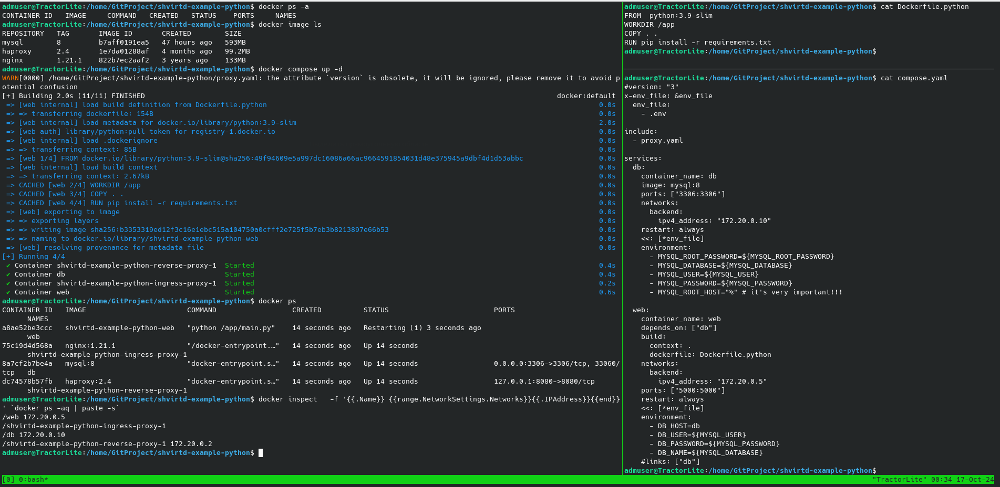

## <p style="text-align: center;">ОТЧЕТ</p> <p style="text-align: center;">по домашнему заданию к занятию 5 «Практическое применение Docker»</p>
## <p style="text-align: right;">Выполнил: студент Порсев И.С.</p>

Состав виртуального стенда в рамках домашнего задания: \


## Задача 1
1. Сделать в своем github пространстве fork репозитория. Примечание: В связи с доработкой кода python приложения. Если вы уверены что задание выполнено вами верно, а код python приложения работает с ошибкой то используйте вместо main.py файл old_main.py(просто измените CMD)
2. Создать файл с именем Dockerfile.python для сборки данного проекта(для 3 задания изучите https://docs.docker.com/compose/compose-file/build/). Используйте базовый образ python:3.9-slim. Обязательно используйте конструкцию COPY . . в Dockerfile. Не забудьте исключить ненужные в имадже файлы с помощью dockerignore. Протестируйте корректность сборки.
3. (Необязательная часть, *) Изучить инструкцию в проекте и запустите web-приложение без использования docker в venv. (Mysql БД можно запустить в docker run).
4. (Необязательная часть, *) По образцу предоставленного python кода внести в него исправление для управления названием используемой таблицы через ENV переменную.


### <div style="text-align: center;">Решение</div>
>по пунктам 1-2: снимки экрана представлены в задании 3.


## Задача 2 (*)
1. Создать в yandex cloud container registry с именем "test" с помощью "yc tool".
2. Настроить аутентификацию вашего локального docker в yandex container registry.
3. Собрать и залить в него образ с python приложением из задания №1.
4. Просканировать образ на уязвимости.
В качестве ответа приложите отчет сканирования.


## Задача 3
1. Изучить файл "proxy.yaml"
2. Создать в репозитории с проектом файл compose.yaml. С помощью директивы "include" подключите к нему файл "proxy.yaml".
3. Описать в файле compose.yaml следующие сервисы:
- web. Образ приложения должен ИЛИ собираться при запуске compose из файла Dockerfile.python ИЛИ скачиваться из yandex cloud container registry(из задание №2 со *). Контейнер должен работать в bridge-сети с названием backend и иметь фиксированный ipv4-адрес 172.20.0.5. Сервис должен всегда перезапускаться в случае ошибок. Передайте необходимые ENV-переменные для подключения к Mysql базе данных по сетевому имени сервиса web
- db. image=mysql:8. Контейнер должен работать в bridge-сети с названием backend и иметь фиксированный ipv4-адрес 172.20.0.10. Явно перезапуск сервиса в случае ошибок. Передайте необходимые ENV-переменные для создания: пароля root пользователя, создания базы данных, пользователя и пароля для web-приложения.Обязательно используйте уже существующий .env file для назначения секретных ENV-переменных!
4. Запустить проект локально с помощью docker compose , добейтесь его стабильной работы: команда curl -L http://127.0.0.1:8090 должна возвращать в качестве ответа время и локальный IP-адрес. Если сервисы не стартуют воспользуйтесь командами: docker ps -a  и docker logs <container_name> . Если вместо IP-адреса вы получаете NULL --убедитесь, что вы шлете запрос на порт 8090, а не 5000.
5. Подключится к БД mysql с помощью команды docker exec -ti <имя_контейнера> mysql -uroot -p<пароль root-пользователя>(обратите внимание что между ключем -u и логином root нет пробела. это важно!!! тоже самое с паролем) . Введите последовательно команды (не забываем в конце символ ; ): show databases; use <имя вашей базы данных(по-умолчанию example)>; show tables; SELECT * from requests LIMIT 10;.
6. Остановить проект. В качестве ответа приложите скриншот sql-запроса.

### <div style="text-align: center;">Решение</div>
>по пунктам 1-3

>по пунктам 4-5


## Задача 4

1. Запустить в Yandex Cloud ВМ (вам хватит 2 Гб Ram).
2. Подключится к Вм по ssh и установите docker.
3. Написать bash-скрипт, который скачает ваш fork-репозиторий в каталог /opt и запустит проект целиком.
4. Зайти на сайт проверки http подключений, например(или аналогичный): https://check-host.net/check-http и запустите проверку вашего сервиса http://<внешний_IP-адрес_вашей_ВМ>:8090. Таким образом трафик будет направлен в ingress-proxy. ПРИМЕЧАНИЕ: приложение(old_main.py) весьма вероятно упадет под нагрузкой, но успеет обработать часть запросов - этого достаточно. Обновленная версия (main.py) не прошла достаточного тестирования временем, но должна справиться с нагрузкой.
5. (*) Дополнительно настроить remote ssh context к вашему серверу. Отобразите список контекстов и результат удаленного выполнения docker ps -a
6. В качестве ответа повторить sql-запрос и приложите скриншот с данного сервера, bash-скрипт и ссылку на fork-репозиторий.

### <div style="text-align: center;">Решение</div>
>по пункту 1    
  
>по пунктам 2-3           

>по пунктy 4           

```
Ссылка на репозиторий: git@github.com:PersIlya/shvirtd-example-python.git
```


## Задача 5 (*)
1. Написать и задеплоить на облачную ВМ bash скрипт, который произведет резервное копирование БД mysql в директорию "/opt/backup" с помощью запуска в сети "backend" контейнера из образа schnitzler/mysqldump при помощи docker run ... команды. Подсказка: "документация образа."
2. Протестировать ручной запуск
3. Настроить выполнение скрипта раз в 1 минуту через cron, crontab или systemctl timer. Придумайте способ не светить логин/пароль в git!!
4. Предоставить скрипт, cron-task и скриншот с несколькими резервными копиями в "/opt/backup"  
   


## Задача 6 
0. Скачать docker образ hashicorp/terraform:latest и скопировать бинарный файл /bin/terraform на свою локальную машину, используя dive и docker save.  
1. Добится аналогичного результата, используя docker cp.
2. (*) Предложить способ извлечь файл из контейнера, используя только команду docker build и любой Dockerfile.
Предоставьте скриншоты действий.

### <div style="text-align: center;">Решение</div>
>по пункту 0

>по пункту 1


## Задача 7 (*)
Запустить ваше python-приложение с помощью runC, не используя docker или containerd.
Предоставьте скриншоты действий.
